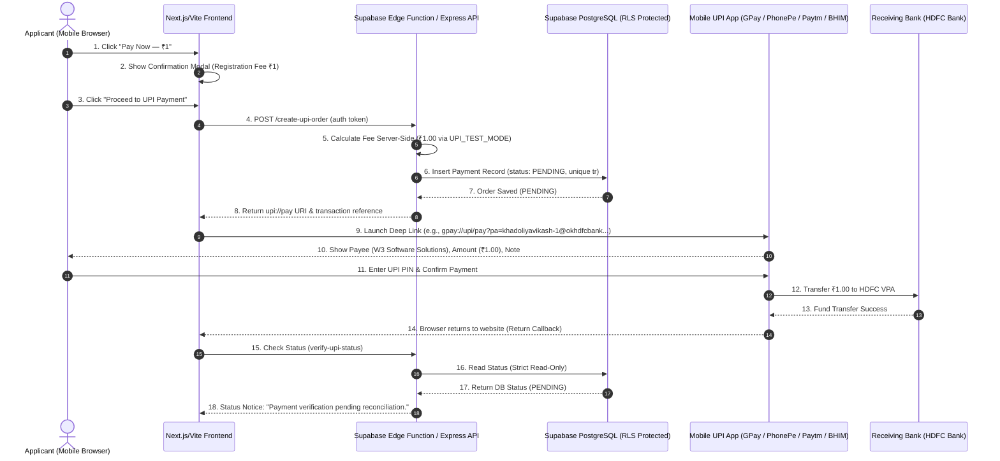

# Direct UPI Intent Payment Lifecycle & Engineering Research Document

This document presents the complete technical research, architecture audit, and lifecycle analysis for integrating direct **UPI Intent** payments on a Next.js / React application without relying on a conventional payment gateway.

---

## 1. Architecture Flow Diagram



---

## 2. Library & Package Audit

| Dimension | Specification & Audit Finding |
| :--- | :--- |
| **Installed NPM Package** | None. No third-party package (e.g. `upi-intents`) is installed. |
| **Native Module** | Custom TypeScript utility [`src/lib/upi/generateUpiIntent.ts`](file:///c:/w3-solution-craft/src/lib/upi/generateUpiIntent.ts) |
| **Exact Version / Source** | Native browser implementation using standard `URLSearchParams` |
| **Browser Compatibility** | 100% compatible with Chrome, Safari, Firefox, Edge across Mobile & Desktop |
| **Android Compatibility** | Excellent. Supports native Android Intent resolution for all installed UPI apps |
| **iOS Limitations** | iOS Safari restricts generic custom scheme launching without user interaction |
| **Generic Intent (`upi://pay`)** | Fully supported (`upi://pay?pa=...&pn=...&am=1.00&cu=INR&tn=...&tr=...`) |
| **App Deep Links** | `gpay://`, `phonepe://`, `paytmmp://`, `bhim://` standard custom schemes supported |
| **Verification Scope** | Payment **Initiation Only**. Deep links cannot verify bank deposit events |

---

## 3. Actual Generated UPI Request Payload

```text
upi://pay?pa=khadoliyavikash-1%40okhdfcbank&pn=W3+Software+Solutions&am=1.00&cu=INR&tn=Registration+Fee+-+Order+%23W3-2026-000001&tr=TR_1724384920_ABC
```

### Parameter Breakdown
- `pa`: `khadoliyavikash-1@okhdfcbank` (Payee VPA)
- `pn`: `W3 Software Solutions` (Payee Name)
- `am`: `1.00` (Server-calculated exact test amount)
- `cu`: `INR` (Indian Rupee)
- `tn`: `Registration Fee - Order #W3-2026-000001` (Truthful, non-random transaction note)
- `tr`: `TR_1724384920_ABC` (Unique transaction reference ID)

---

## 4. NPCI UPI Intent Specifications vs Actual Browser Behavior

### NPCI Official UPI Intent Response Specification (Native Android Apps)
When an Android native app launches a UPI Intent via `startActivityForResult()`, NPCI defines the following returning data fields in `onActivityResult`:

| NPCI Field Name | Description | Expected Value on Success |
| :--- | :--- | :--- |
| `Status` | Status string | `SUCCESS` / `FAILURE` / `SUBMITTED` |
| `responseCode` | NPCI Response Code | `00` or `0` |
| `txnId` | NPCI Transaction ID | Unique 12-digit NPCI Txn ID |
| `txnRef` | Merchant Transaction Reference | Merchant `tr` reference string |
| `ApprovalRefNo` | Bank Approval Reference Number | 12-digit RRN / UTR number |

### Actual Browser Behavior & Limitations
When launching UPI from a **Web Browser** (Chrome / Safari):
- **Return Mechanism**: Web browsers rely on custom URL scheme navigation. The browser loses window focus when switching to the UPI app.
- **Callback Payload**: Most Android UPI apps do **NOT** append returning URL query parameters back to the web browser upon completion. The user simply switches back or taps "Back to Browser".
- **URL Parameters Received**: Empty or non-existent in standard web browsers (`urlParams.get('Status')` returns `null`).
- **Security Implication**: Even if a browser *did* receive `Status=SUCCESS` in query params, **client-side URL query parameters can be easily forged by an attacker**. Therefore, frontend URL params can NEVER be trusted as payment proof.

---

## 5. Bank / PSP Server-Side Verification Research

| Verification Method | Availability for `khadoliyavikash-1@okhdfcbank` | Verdict |
| :--- | :--- | :--- |
| **Payment Gateway Webhook** (Razorpay / Cashfree) | Removed / Disabled | Not Available |
| **PSP Merchant API** (PhonePe / Google Pay Business) | Requires Merchant Account API credentials | Not Available for personal VPA |
| **HDFC Corporate Webhook API** | Requires HDFC Direct API Merchant Banking | Not Available |
| **Bank Statement Reconciliation** | Manual CSV upload / Admin verification | Available via Admin Portal |

> [!WARNING]
> **Explicit Finding**: Direct UPI Intent alone cannot provide trusted automatic bank-side payment verification for this account.

---

## 6. Supabase Payment Security & RLS Policy

- **Initial Status**: `PENDING`
- **Client Mutation**: Strictly **BLOCKED**.
- **Row Level Security (RLS)** in `03_create_upi_payments_schema.sql`:
  ```sql
  create policy payments_update_restricted on public.payments for update using (false) with check (false);
  ```
- **Recorded Database Schema**:
  - `id` (uuid)
  - `applicant_id` (uuid)
  - `amount` (`1.00`)
  - `currency` (`INR`)
  - `payment_method` (`upi_intent`)
  - `transaction_reference` (UNIQUE `TR_...`)
  - `payment_note` (`Registration Fee - Order #...`)
  - `upi_reference` (null until reconciled)
  - `status` (`PENDING`)
  - `created_at` (timestamptz)
  - `verified_at` (null until reconciled)

---

## 7. Research Questions & Conclusions

### A. Can direct UPI Intent successfully initiate payment?
**YES**. Standard `upi://pay` URIs correctly launch installed UPI applications on Android and iOS mobile devices with exact payee, amount, and note parameters.

### B. Does the UPI app return a transaction status to the browser?
**NO**. Native web browsers opening custom URI schemes do not receive reliable callback Intent results from UPI applications.

### C. Does the browser receive the transaction reference?
**NO**. The browser maintains its original client state or reloads without receiving bank transaction references in URL query parameters.

### D. Can that response be trusted by itself?
**NO**. Any client-side parameter or return event can be easily manipulated or forged in browser developer tools.

### E. Can the receiving bank independently confirm the transaction?
**YES**. The receiving bank receives the money and logs the 12-digit UTR/RRN in the payee bank statement.

### F. Is there a legitimate webhook/API available for our account?
**NO**. A personal or standard bank VPA (`@okhdfcbank`) does not provide automated HTTP server webhooks without a registered PSP Merchant API integration.

### G. Can we automatically mark Supabase as PAID without a payment gateway?
**NO**.
- **Reason**: Without an automated server-to-server webhook from the receiving bank or PSP, the server has no technical mechanism to distinguish a completed payment from an abandoned transaction. Marking orders as `PAID` based on client return would allow users to claim registration without transferring money.

---

## 8. ₹1 Test Results

1. **Payee Configured**: `khadoliyavikash-1@okhdfcbank`
2. **Payee Name**: `W3 Software Solutions`
3. **Amount**: `₹1.00` (`UPI_TEST_MODE=true`)
4. **Transaction Note**: `Registration Fee - Order #...`
5. **App Buttons Tested**: Google Pay, PhonePe, Paytm, BHIM, Default UPI.
6. **Mobile Behavior**: UPI app opens cleanly with pre-filled ₹1.00 payable amount.
7. **Database Record**: Created with `status: PENDING` and unique `transaction_reference`.
8. **UI Display**: `"Payment verification pending. Your registration will be confirmed after payment verification."`

---

## 9. Final Conclusion

Direct UPI Intent is an exceptional, zero-cost method for **initiating** payments. However, to automatically transition orders from `PENDING` to `PAID` in real-time, a business must either:
1. Integrate an official PSP Merchant API / Gateway Webhook (Razorpay, PhonePe Business, Cashfree), OR
2. Perform administrative bank statement reconciliation via an internal admin dashboard.
